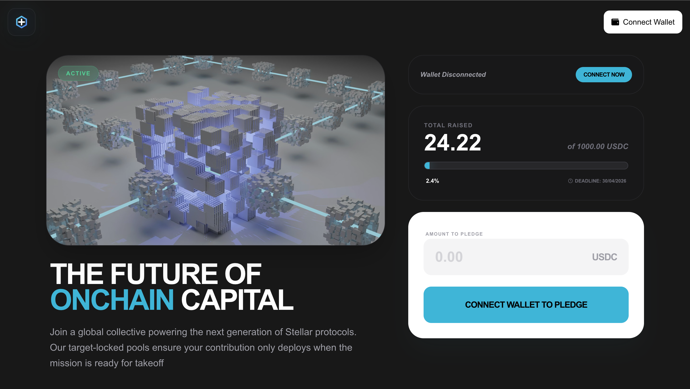
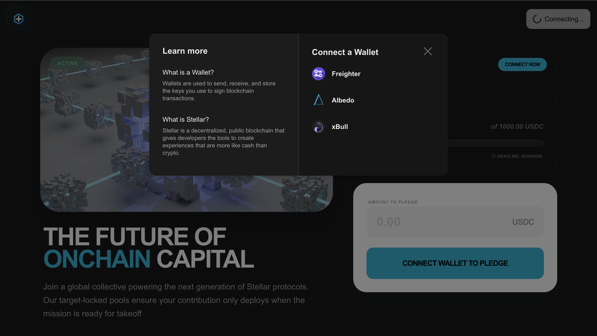
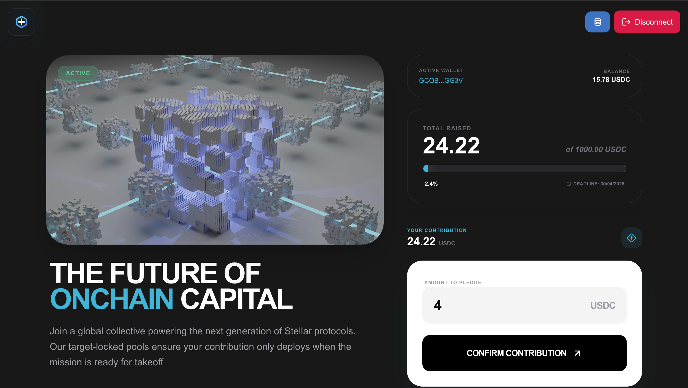
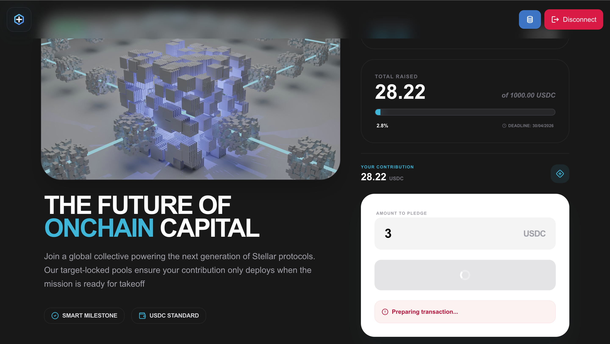
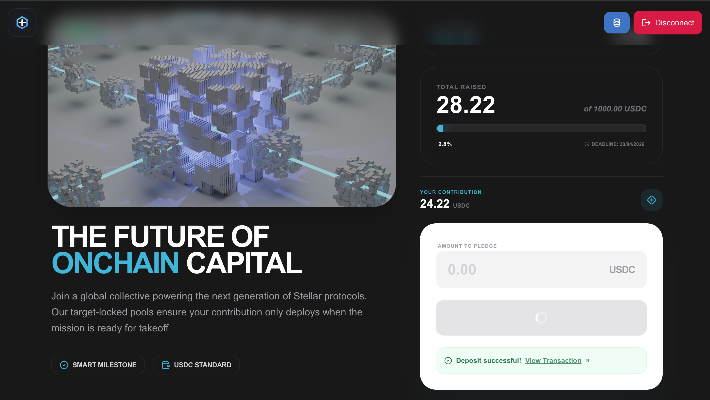
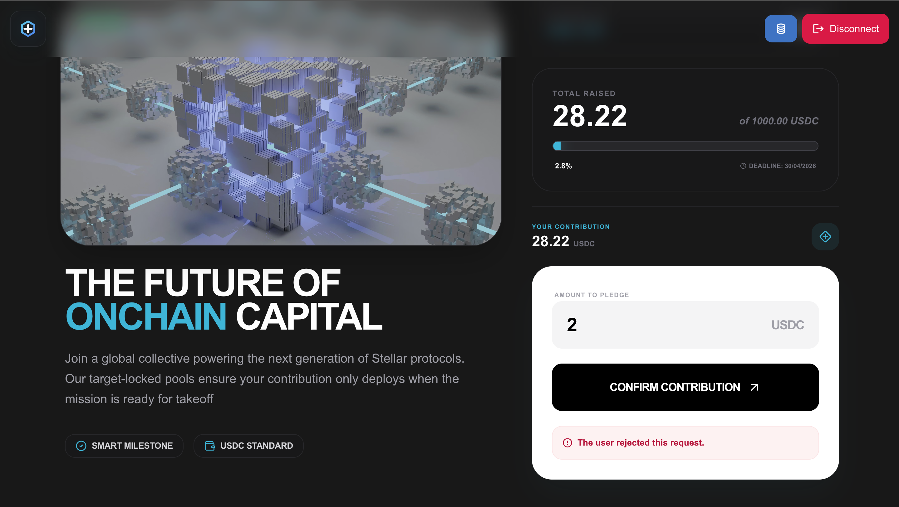
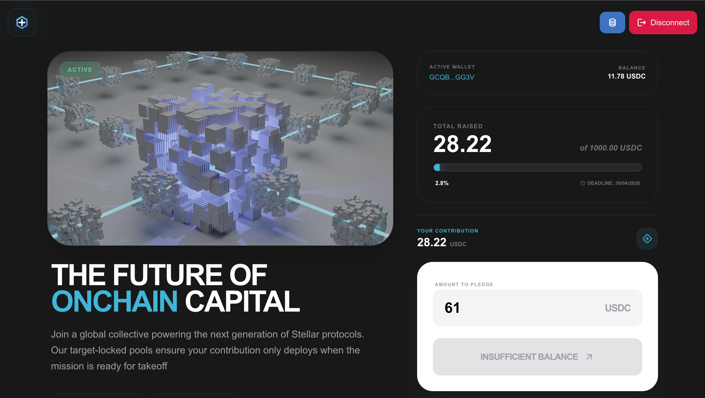

 # 🚀 Crowdfund Protocol

A decentralized, trustless crowdfunding platform built on the **Stellar Soroban** smart contract engine. This protocol allows creators to raise funds in **USDC** with a "Goal or Nothing" mechanism, ensuring that funds are only released if the campaign target is met, otherwise, they remain secure for contributor protection.

**Level 2 – Blue Belt Submission**

---

## ✨ Features

* **Smart Contract Governance**: Fully governed by a Soroban Rust contract.
* **USDC Standard**: Utilizes the official Circle USDC on Stellar Testnet for stable, real-world value simulation.
* **Trustless Contributions**: Contributions are locked in the contract until the deadline.
* **Real-time Global State**: View campaign progress, total raised, and target status even without a wallet connected.
* **Personal Contribution Tracking**: Users can see their specific pledge balance directly from the contract state.
* **Multi-Wallet Support**: Integrated via `@creit.tech/stellar-wallets-kit` for Freighter, xBull, and more.

---

## 🛠️ Tech Stack

* **Frontend**: Next.js 14 (App Router), Tailwind CSS, Lucide React.
* **Smart Contracts**: Rust / Soroban SDK.
* **Blockchain**: Stellar Testnet.
* **Tools**: `@stellar/stellar-sdk`, `Soroban RPC`.

---

## 📜 Contract Details

| Field | Value |
| --- | --- |
| **Contract ID** | `CD2UNSAD6GI5FX7NWFO3IU72E7LNP7OQDGQ4G7VURXY7GFULNBNFLM5J` |
| **Network** | Stellar Testnet |
| **Token Asset** | USDC (`GBBD47IF6LWK7P7MDEVSCWR7DPUWV3NY3DTQEVFL4NAT4AQH3ZLLFLA5`) |
| **Explorer Link** | [View on Stellar Expert](https://stellar.expert/explorer/testnet/contract/CD2UNSAD6GI5FX7NWFO3IU72E7LNP7OQDGQ4G7VURXY7GFULNBNFLM5J) |

---

## 🚀 Getting Started

### 1. Prerequisites

* [Freighter Wallet](https://www.freighter.app/) installed.
* Freighter set to **Testnet** mode.
* Testnet USDC. (Get it from the [Circle Faucet](https://faucet.circle.com/)).

### 2. Installation

```bash
git clone https://github.com/youthisguy/stellar-crowdfund
cd soroban-crowdfund
npm install

```

### 3. Run Locally

```bash
npm run dev

```

Navigate to `http://localhost:3000`.

---

## ✅ Submission Requirements

* [x] **Wallet Integration**: Connect/Disconnect via Freighter.
* [x] **Contract Interaction**: Implements `deposit` and `get_contribution` contract calls.
* [x] **Read-Only Simulation**: Fetches global campaign stats on page load without requiring a signature.
* [x] **Transaction Feedback**: Real-time status updates, transaction hashes and Error handling.
* [x] **Verifiable Onchain**: All logic is handled by the deployed `CONTRACT_ID` provided above.

---

## 📸 Screenshots

### 1. Global Campaign Dashboard
*Real-time progress tracking fetching contract data.*



### 2. Multi-Wallet Integration
*Implementation of StellarWalletsKit showing multiple wallet options.*



### 3. Wallet & Personal Contribution
*User-specific data display, including USDC balance and individual pledge amounts synchronized with the contract.*



### 4. Transaction Lifecycle (Pending & Success)
*Real-time status tracking showing the transition from a pending Soroban RPC call to a successful on-chain confirmation.*




### 5. Error Handling & Resilience
*Error handling, UI feedback.*




## 🔗 Verifiable Transaction

**Successful Deposit Hash:** [View on Stellar Explorer](https://stellar.expert/explorer/testnet/tx/eec9ed488181dd3b49f69ca6176ca65fa5a2ef694c0960734396edf95a5cc063)

---

**🚀 Live Demo:** [https://stellar-crowdfund.vercel.app/](https://stellar-crowdfund.vercel.app/)
