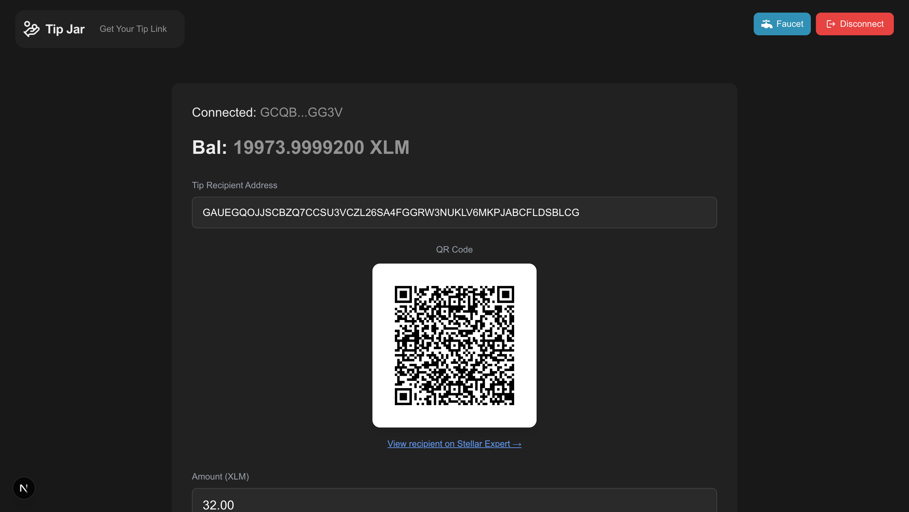
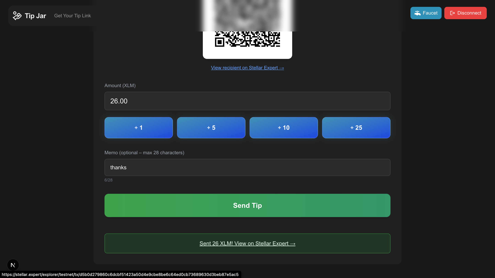
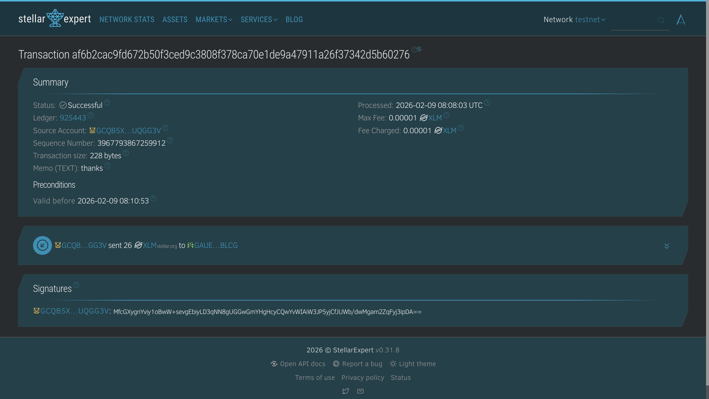

# Stellar Tip Jar

A simple, beginner-friendly **Stellar testnet tipping dApp** built for the Stellar Hackathon (White Belt – Level 1).  
Users connect their wallet (Freighter / others via Wallets Kit), view their XLM balance, enter a recipient address and amount (with optional memo), generate a scannable QR code, and send tips on testnet.

---

## ✨ Features
- 🔗 Connect / disconnect Stellar wallet (Freighter, xBull, etc.)
- 💰 Display connected wallet balance (auto-refreshes)
- 💸 Send XLM payments with optional memo
- 📱 Dynamic QR code (SEP-0007 format – pre-fills amount in compatible wallets)
- ⚡ Preset amount buttons (+1, +5, +10, +25 XLM)
- 🚰 One-click testnet faucet request (Friendbot integration)
- 🔗 Shareable personal tip link (`/?address=...`)
- ✅ Transaction success feedback with clickable Stellar Expert link

---

## 🛠️ Tech Stack
- **Next.js 14** (App Router)
- **TypeScript**
- **Tailwind CSS**
- **@creit.tech/stellar-wallets-kit**
- **@stellar/stellar-sdk**
- **lucide-react** (icons)
- **qrcode.react**

---

## ✅ Requirements Met (Level 1 – White Belt)
- ✓ Freighter / wallet connect & disconnect
- ✓ Fetch & display XLM balance
- ✓ Send XLM transaction on testnet
- ✓ Transaction feedback (success/failure + hash/explorer link)
- ✓ Public GitHub repo + README with screenshots

---

## 🚀 Setup Instructions

1. **Clone the repository**
```bash
   git clone https://github.com/youthisguy/stellar-tip-jar.git
   cd stellar-tip-jar
```

2. **Install dependencies**
```bash
   npm install
```

3. **Run the development server**
```bash
   npm run dev
```

4. **Open http://localhost:3000 in your browser**

5. **Prepare your wallet**
   - Install [Freighter](https://www.freighter.app/) (or another supported wallet like xBull)
   - Switch to **Testnet** in wallet settings
   - Fund your account if needed:
     - Use the **"Faucet"** button in the app sidebar (recommended), or
     - Manually via Friendbot:
```
       https://friendbot.stellar.org?addr=YOUR_PUBLIC_KEY_HERE
```

6. **Test the app**
   - Connect wallet via the sidebar button
   - Enter recipient address (or use `/?address=GB...` in the URL)
   - Add amount + optional memo
   - Click "Send Tip" and confirm in your wallet
   - Check success message + explorer link

---

## 📸 Screenshots

### 1. Wallet Connected State


*Shows connected address, faucet button, copy icon and disconnect button*

### 2. Balance Displayed


*Main page showing real-time XLM balance after connecting and funding*

### 3. Transaction Result Shown to User


*Success feedback with clickable link to Stellar Expert explorer*

### 4. Successful Testnet Transaction 


*Successful transaction confirmed on Stellar Expert*
